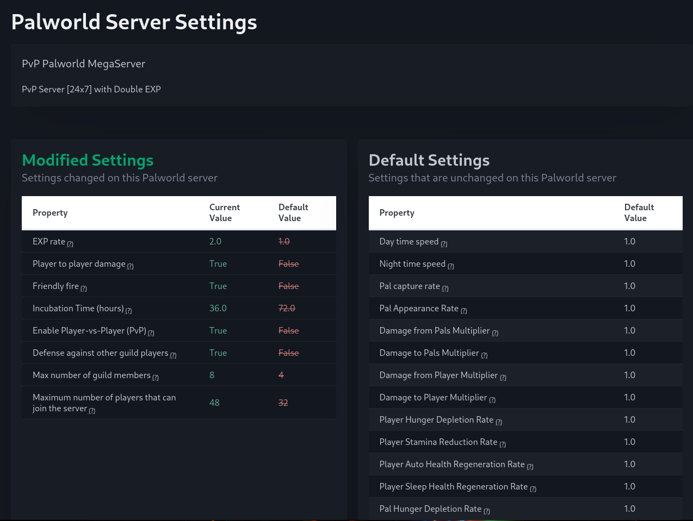

# Palworld Settings Web View

*Developed by https://palworld.lol*

This is a single page web app that shows your Palworld dedicated server settings. It shows all settings and which ones are different than default values.



Here are a couple real world examples:

- https://depresso.palworld.lol
- https://kingpaca.palworld.lol

## Configuration

Configuration is very simple. There are environment variables available for each Palworld setting and you can configure each on (if you want) with either:

- `hide-default`
- `hide-always`

By default, all Palworld settings are visible no matter their value (default or modified). Of course, passwords and network related settings are not shown.

Example #1: if you set `PAL_CAPTURE_RATE=hide-default` then the Pal Capture Rate setting will not be shown in the defaults list. _However_, if you modify the Pal Capture Rate, it will be shown in the modified list.

Example #2: if you set `PAL_CAPTURE_RATE=hide-always` then the Pal Capture Rate setting will not be shown in the default list _or_ in the modified list. It will be hidden all of the time. 

The full list of environment variables is at the [bottom of this document](#environment-variables). 


## Docker

Docker one-liner. Make sure to replace `-v` with the correct path to your palworld storage:

```
$ docker run --name palworld-settings-web-view  -d -p 8000:8000 -v ./palworld/Pal/Saved:/palworld:ro docker.io/bostrt/palworld-settings-view:latest
$ docker logs palworld-settings-web-view
```

## Docker Compose

Below is a minimal working `docker-compose.yml`. Make sure to replace the `volumes` with the correct path to your palworld storage. The application automatically tries to find `PalWorldSettings.ini` inside the mounted directory.

```
services:
  pw-settings-view:
    image: docker.io/bostrt/palworld-settings-web-view:latest
    pull_policy: always
    restart: unless-stopped
    container_name: palworld-settings-web-view
    ports:
      - 8000:8000/tcp
    volumes:
      - ./palworld/Pal/Saved:/palworld:ro
```

And bring up the container using: `docker compose up -d`

## Run locally

TODO

## Environment Variables

Here is the list of environment variables available to hide the default value or always hide no matter default value or modified:

- `DAYTIME_SPEEDRATE`
- `NIGHTTIME_SPEEDRATE`
- `EXP_RATE`
- `PAL_CAPTURE_RATE`
- `PAL_SPAWN_NUM_RATE`
- `PAL_DAMAGE_RATE_ATTACK`
- `PAL_DAMAGE_RATE_DEFENSE`
- `PLAYER_DAMAGE_RATE_ATTACK`
- `PLAYER_DAMAGE_RATE_DEFENSE`
- `PLAYER_STOMACH_DECREASE_RATE`
- `PLAYER_STAMINA_DECREASE_RATE`
- `PLAYER_AUTO_HP_REGEN_RATE`
- `PLAYER_AUTO_HP_REGEN_RATE_IN_SLEEP`
- `PAL_STOMACH_DECREASE_RATE`
- `PAL_STAMINA_DECREASE_RATE`
- `PAL_AUTO_HP_REGEN_RATE`
- `PAL_AUTO_HP_REGEN_RATE_IN_SLEEP`
- `BUILD_OBJECT_DAMAGE_RATE`
- `BUILD_OBJECT_DETERIORATION_DAMAGE_RATE`
- `COLLECTION_DROP_RATE`
- `COLLECTION_OBJECT_HP_RATE`
- `COLLECTION_OBJECT_RESPAWN_SPEED_RATE`
- `ENEMY_DROP_ITEM_RATE`
- `DEATH_PENALTY`
- `ENABLE_INVADER_ENEMY`
- `GUILD_PLAYER_MAX_NUM`
- `PAL_EGG_DEFAULT_HATCHING_TIME`
- `SERVER_PLAYER_MAX_NUM`
- `DIFFICULTY`
- `ENABLE_PLAYER_TO_PLAYER_DAMAGE`
- `ENABLE_FRIENDLY_FIRE`
- `ENABLE_AIM_ASSIST_PAD`
- `ENABLE_AIM_ASSIST_KEYBOARD`
- `DROP_ITEM_MAX_NUM`
- `DROP_ITEM_MAX_NUM_UNKO`
- `BASE_CAMP_MAX_NUM`
- `BASE_CAMP_WORKER_MAX_NUM`
- `DROP_ITEM_ALIVE_MAX_HOURS`
- `AUTO_RESET_GUILD_NO_ONLINE_PLAYERS`
- `AUTO_RESET_GUILD_TIME_NO_ONLINE_PLAYERS`
- `WORK_SPEED_RATE`
- `IS_PVP`
- `CAN_PICKUP_OTHER_GUILD_DEATH_PENALTY_DROP`
- `ENABLE_NON_LOGIN_PENALTY`
- `ENABLE_FAST_TRAVEL`
- `IS_START_LOCATION_SELECT_BY_MAP`
- `EXIST_PLAYER_AFTER_LOGOUT`
- `ENABLE_DEFENSE_OTHER_GUILD_PLAYER`
- `COOP_PLAYER_MAX_NUM`
